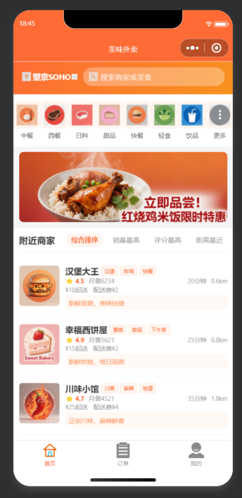
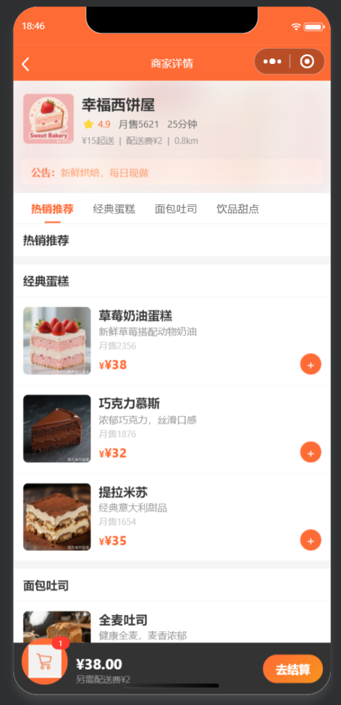
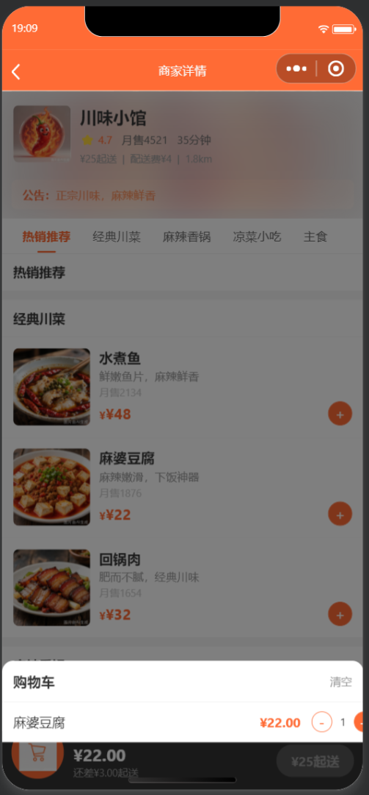
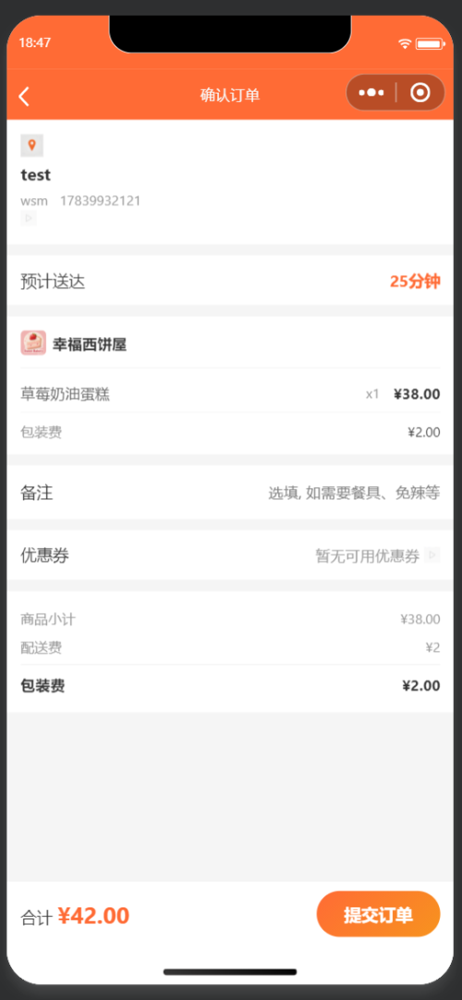
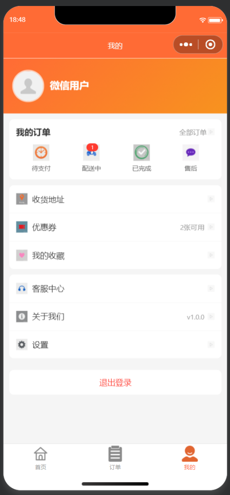
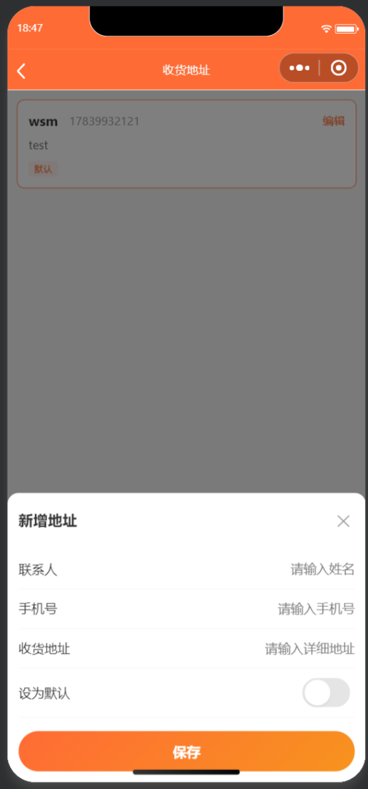

# 🍔 美味外卖小程序 / 미식배달 미니프로그램 (HungryHub)

> 一个功能完整的外卖平台微信小程序，涵盖从浏览商家、选择菜品、购物车管理到下单支付、订单追踪的全流程。  
> 상점 탐색, 메뉴 선택, 장바구니 관리부터 주문 결제, 주문 추적까지 전 과정을 아우르는 완전한 기능의 배달 플랫폼 위챗 미니프로그램입니다.

---

## 📑 目录 / 목차

- [功能特性 / 기능 특성](#-功能特性--기능-특성)
- [使用的 AI 工具 / 사용된 AI 도구](#-使用的-ai-工具--사용된-ai-도구)
- [项目结构 / 프로젝트 구조](#-项目结构--프로젝트-구조)
- [页面路由与导航 / 페이지 라우팅 및 네비게이션](#-页面路由与导航--페이지-라우팅-및-네비게이션)
- [核心业务逻辑 / 핵심 비즈니스 로직](#-核心业务逻辑--핵심-비즈니스-로직)
- [数据流架构 / 데이터 흐름 아키텍처](#-数据流架构--데이터-흐름-아키텍처)
- [技术栈详解 / 기술 스택 상세](#-技术栈详解--기술-스택-상세)
- [UI/UX 设计 / UI/UX 디자인](#-uiux-设计--uiux-디자인)
- [图片资源清单 / 이미지 리소스 목록](#-图片资源清单--이미지-리소스-목록)
- [运行截图 / 실행 스크린샷](#-运行截图--실행-스크린샷)
- [使用说明 / 사용 설명](#-使用说明--사용-설명)
- [开发计划 / 개발 계획](#-开发计划--개발-계획)

---

## 🚀 功能特性 / 기능 특성

### 🏠 首页 / 홈

- **📍 定位选择 / 위치 선택**：支持手动选择当前位置，调用微信原生地图选点能力  
  수동으로 현재 위치 선택 가능, 위챗 네이티브 지도 위치 선택 기능 호출
- **🔍 商家搜索 / 상점 검색**：支持按商家名称、标签、菜品名称多维度搜索，含搜索历史记录（最近10条）与热门搜索词推荐  
  상점명, 태그, 메뉴명 다차원 검색 지원, 검색 기록(최근 10개) 및 인기 검색어 추천 포함
- **📂 分类快捷入口 / 카테고리 바로가기**：8 大分类（中餐/西餐/日料/甜品/快餐/轻食/饮品/更多），一键筛选  
  8대 카테고리(중식/양식/일식/디저트/패스트푸드/건강식/음료/더보기) 원클릭 필터링
- **🎠 Banner 广告轮播 / 배너 광고 슬라이드**：使用 `<swiper>` 组件实现 3 张广告横幅自动轮播（3 秒间隔，圆点指示器）  
  `<swiper>` 컴포넌트로 3장 광고 배너 자동 슬라이드 (3초 간격, 도트 인디케이터)
- **📋 商家列表 / 상점 목록**：展示 Logo、店名、标签、评分（⭐星标 + 数值）、月销量、配送时间、距离、起送价、配送费、公告  
  로고, 상점명, 태그, 평점(⭐별점 + 수치), 월 판매량, 배달 시간, 거리, 최소 주문 금액, 배달비, 공지사항 표시
- **🔀 四种排序方式 / 4가지 정렬 방식**：综合排序（评分×销量）、销量最高、评分最高、距离最近，前端数组排序即时切换  
  종합순(평점×판매량), 판매량순, 평점순, 거리순, 프론트엔드 배열 정렬 즉시 전환
- **📱 下拉刷新 & 上拉加载 / 풀다운 새로고침 & 풀업 로딩**：原生下拉刷新 + 模拟分页加载机制  
  네이티브 풀다운 새로고침 + 모의 페이지네이션 로딩 메커니즘

### 🏪 商家详情 / 상점 상세

- **📊 商家信息展示 / 상점 정보 표시**：评分、月销量、配送时间、距离、起送价、配送费，头部采用毛玻璃模糊背景效果 (`filter: blur(20px)`)  
  평점, 월 판매량, 배달 시간, 거리, 최소 주문 금액, 배달비, 헤더에 글래스모피즘 블러 배경 효과 (`filter: blur(20px)`)
- **📑 分类菜单导航 / 카테고리 메뉴 네비게이션**：横向滚动 `<scroll-view>`，sticky 定位吸附顶部，点击切换分类高亮（橙色下划线指示）  
  가로 스크롤 `<scroll-view>`, sticky 포지셔닝 상단 고정, 클릭 시 카테고리 전환 하이라이트 (주황색 밑줄 인디케이터)
- **🍽️ 菜品列表 / 메뉴 목록**：按分类分组展示，每个菜品显示图片、名称、描述、月销量、单价、加减按钮  
  카테고리별 그룹 표시, 각 메뉴는 이미지, 이름, 설명, 월 판매량, 단가, 증감 버튼 표시
- **🛒 底部购物车栏 / 하단 장바구니 바**：固定底部显示，实时更新总数量和总价，显示起送差价提示  
  하단 고정 표시, 총 수량 및 총 금액 실시간 업데이트, 최소 주문 차액 안내
- **📋 购物车弹窗 / 장바구니 팝업**：点击展开购物车详情列表，支持清空购物车、查看每项商品小计  
  클릭 시 장바구니 상세 목록 확장, 장바구니 비우기, 각 상품 소계 확인 지원
- **📳 触觉反馈 / 햅틱 피드백**：添加商品时触发轻量震动反馈 (`wx.vibrateShort`)  
  상품 추가 시 경량 진동 피드백 트리거 (`wx.vibrateShort`)

### 🛍️ 下单结算 / 주문 결제

- **📍 收货地址管理 / 배송지 관리**：支持新增、编辑、设为默认地址，表单验证（联系人非空、手机号正则 `/^1\d{10}$/`、地址非空）  
  신규 추가, 편집, 기본 주소 설정 지원, 폼 유효성 검증 (연락처 필수, 휴대폰 정규식 `/^1\d{10}$/`, 주소 필수)
- **📦 商品清单确认 / 상품 목록 확인**：展示每项商品的名称、规格、数量、小计（预计算 `toFixed(2)`）  
  각 상품의 이름, 규격, 수량, 소계 표시 (사전 계산 `toFixed(2)`)
- **📝 订单备注 / 주문 메모**：自由文本输入  
  자유 텍스트 입력
- **💰 价格明细 / 가격明细**：商品总额 + 包装费 + 配送费 - 优惠 = 实付金额，实时计算  
  상품 총액 + 포장비 + 배달비 - 할인 = 실결제 금액, 실시간 계산
- **💳 模拟支付 / 모의 결제**：生成唯一订单号（`DD + 时间戳`），1 秒模拟提交延迟，成功后清空购物车并跳转订单页  
  고유 주문번호 생성 (`DD + 타임스탬프`), 1초 모의 제출 지연, 성공 시 장바구니 비우고 주문 페이지로 이동

### 📋 订单管理 / 주문 관리

- **🗂️ 分类查看 / 카테고리별 보기**：全部 / 待支付 / 配送中 / 已完成，四 Tab 前端数组过滤  
  전체 / 결제대기 / 배달중 / 완료, 4탭 프론트엔드 배열 필터링
- **❌ 取消订单 / 주문 취소**：确认弹窗后从 `wx.Storage` 删除订单  
  확인 팝업 후 `wx.Storage`에서 주문 삭제
- **💵 模拟支付 / 모의 결제**：1.5 秒加载动画，状态更新为"配送中"  
  1.5초 로딩 애니메이션, 상태 "배달중"으로 업데이트
- **✅ 确认收货 / 수령 확인**：确认弹窗后状态更新为"已完成"  
  확인 팝업 후 상태 "완료"로 업데이트
- **🔄 再来一单 / 재주문**：跳转至原商家详情页  
  원래 상점 상세 페이지로 이동
- **🏠 空状态引导 / 빈 상태 가이드**：无订单时显示空状态图标和"去首页逛逛"按钮  
  주문 없을 시 빈 상태 아이콘과 "홈으로 가기" 버튼 표시

### 👤 个人中心 / 마이페이지

- **🔐 用户登录 / 사용자 로그인**：调用 `wx.getUserProfile` 获取微信用户头像和昵称，持久化存储  
  `wx.getUserProfile` 호출로 위챗 사용자 아바타 및 닉네임 획득, 영구 저장
- **📊 订单入口 / 주문 바로가기**：显示待支付和配送中订单数量红点徽标  
  결제대기 및 배달중 주문 수량 빨간색 배지 표시
- **📍 收货地址管理 / 배송지 관리**：独立地址管理页面入口  
  독립 주소 관리 페이지 진입
- **🎫 功能入口 / 기능 바로가기**：优惠券、收藏、帮助中心、设置等预留入口（含图标）  
  쿠폰, 즐겨찾기, 고객센터, 설정 등 예비 진입점 (아이콘 포함)
- **🚪 退出登录 / 로그아웃**：确认弹窗后清除用户信息和本地存储  
  확인 팝업 후 사용자 정보 및 로컬 저장소 삭제
- **🔗 分享功能 / 공유 기능**：自定义分享标题"美味外卖 - 美食送到家"  
  사용자 정의 공유 제목 "미식배달 - 맛있는 음식을 집으로"

---

## 🤖 使用的 AI 工具 / 사용된 AI 도구

| 工具 / 도구 | 用途 / 용도 | 说明 / 설명 |
|:---|:---|:---|
| **CodeBuddy (Auto)** | AI 编程助手 / AI 프로그래밍 어시스턴트 | 辅助完成项目代码编写、Supabase 数据库设计与数据迁移、文档生成等全流程开发 / 프로젝트 코드 작성, Supabase 데이터베이스 설계 및 데이터 마이그레이션, 문서 생성 등 전체 개발 프로세스 지원 |
| **Supabase** | 后端云数据库 / 백엔드 클라우드 데이터베이스 | 提供 PostgreSQL 数据库服务，存储商家、菜品、分类等核心业务数据，通过 REST API 与小程序前端交互 / PostgreSQL 데이터베이스 서비스 제공, 상점·메뉴·카테고리 등 핵심 비즈니스 데이터 저장, REST API를 통해 미니프로그램 프론트엔드와 연동 |
| **微信开发者工具 / 위챗 개발자 도구** | 小程序开发调试 / 미니프로그램 개발 디버깅 | 提供 WXML/WXSS/JS 编译预览、真机调试、性能分析等功能 / WXML/WXSS/JS 컴파일 미리보기, 실기기 디버깅, 성능 분석 등 기능 제공 |

---

## 📁 项目结构 / 프로젝트 구조

```
HungryHub/
├── app.js                          # 小程序入口，全局状态管理 / 미니프로그램 진입점, 전역 상태 관리
├── app.json                        # 全局配置（路由/TabBar/权限/窗口样式）/ 전역 설정 (라우팅/TabBar/권한/창 스타일)
├── app.wxss                        # 全局样式（按钮/价格/分隔线/空状态等通用组件）/ 전역 스타일 (버튼/가격/구분선/빈 상태 등 공통 컴포넌트)
├── project.config.json             # 微信开发者工具项目配置 / 위챗 개발자 도구 프로젝트 설정
├── sitemap.json                    # 站点地图（SEO索引配置）/ 사이트맵 (SEO 인덱싱 설정)
├── README.md                       # 项目说明文档（本文件）/ 프로젝트 설명 문서 (본 파일)
│
├── utils/                          # 工具模块 / 유틸리티 모듈
│   ├── supabase.js                 # Supabase REST API 封装（商家/菜品/分类/搜索）/ Supabase REST API 래퍼 (상점/메뉴/카테고리/검색)
│   └── mock.js                     # 本地降级数据（6家商家 × 36道菜品 + 地址初始数据）/ 로컬 폴백 데이터 (6개 상점 × 36개 메뉴 + 초기 주소 데이터)
│
├── images/                         # 图片资源目录（81 张 PNG 图片）/ 이미지 리소스 디렉토리 (81장 PNG 이미지)
│   ├── tab-home.png / tab-home-active.png              # TabBar 首页图标 / TabBar 홈 아이콘
│   ├── tab-order.png / tab-order-active.png            # TabBar 订单图标 / TabBar 주문 아이콘
│   ├── tab-mine.png / tab-mine-active.png              # TabBar 我的图标 / TabBar 마이페이지 아이콘
│   ├── banner1.png ~ banner3.png                       # 首页轮播 Banner / 홈 슬라이드 배너
│   ├── shop1.png ~ shop6.png                           # 商家 Logo / 상점 로고
│   ├── cate-chinese.png / cate-western.png / ...       # 8 个分类入口图标 / 8개 카테고리 진입 아이콘
│   ├── food1.png ~ food16.png                          # 菜品图片 / 메뉴 이미지
│   ├── cake1.png ~ cake3.png / bread1.png ~ bread2.png # 蛋糕/面包图片 / 케이크/빵 이미지
│   ├── burger1.png ~ burger2.png / meal1.png ~ meal2.png # 汉堡/套餐图片 / 햄버거/세트 이미지
│   ├── drink1.png ~ drink5.png                         # 饮品类图片 / 음료 이미지
│   ├── noodle1.png ~ noodle2.png / rice1.png           # 面食/米饭图片 / 면류/밥 이미지
│   ├── salad1.png ~ salad2.png / sandwich1.png ~ sandwich2.png # 沙拉/三明治图片 / 샐러드/샌드위치 이미지
│   ├── menu-address.png / menu-coupon.png / ...        # 个人中心菜单图标 (6个) / 마이페이지 메뉴 아이콘 (6개)
│   ├── order-pending.png / order-delivering.png / ...  # 订单状态图标 (4个) / 주문 상태 아이콘 (4개)
│   ├── empty-order.png / empty-cart.png / empty-address.png # 空状态插图 (3个) / 빈 상태 일러스트 (3개)
│   ├── location.png / location-fill.png                # 定位图标 / 위치 아이콘
│   ├── search.png / close.png / cart.png               # 通用操作图标 / 공통 작업 아이콘
│   ├── arrow-down.png / arrow-right.png                # 箭头图标 / 화살표 아이콘
│   └── default-avatar.png                              # 默认头像 / 기본 아바타
│
└── pages/                           # 页面目录 / 페이지 디렉토리
    ├── index/                       # 🏠 首页 / 홈
    │   ├── index.js                 #    定位、分类、Banner、商家列表排序与加载
    │   ├── index.json               #    页面配置
    │   ├── index.wxml               #    页面模板
    │   └── index.wxss               #    页面样式
    ├── shop/                        # 🏪 商家详情页 / 상점 상세
    │   ├── shop.js                  #    菜品列表、分类导航、购物车管理
    │   ├── shop.json
    │   ├── shop.wxml
    │   └── shop.wxss
    ├── search/                      # 🔍 搜索页 / 검색
    │   ├── search.js                #    多维度搜索、搜索历史、热门推荐
    │   ├── search.json
    │   ├── search.wxml
    │   └── search.wxss
    ├── payment/                     # 💳 结算页 / 결제
    │   ├── payment.js               #    地址确认、价格计算、订单生成
    │   ├── payment.json
    │   ├── payment.wxml
    │   └── payment.wxss
    ├── address/                     # 📍 地址管理页 / 주소 관리
    │   ├── address.js               #    地址CRUD、表单验证、弹窗编辑
    │   ├── address.json
    │   ├── address.wxml
    │   └── address.wxss
    ├── order/                       # 📋 订单页 (TabBar) / 주문 (TabBar)
    │   ├── order.js                 #    订单Tab筛选、支付/取消/收货操作
    │   ├── order.json
    │   ├── order.wxml
    │   └── order.wxss
    └── mine/                        # 👤 个人中心 (TabBar) / 마이페이지 (TabBar)
        ├── mine.js                  #    用户登录、订单统计、退出登录
        ├── mine.json
        ├── mine.wxml
        └── mine.wxss
```

---

## 🗺️ 页面路由与导航 / 페이지 라우팅 및 네비게이션

| 页面 / 페이지 | 路由 / 라우트 | 类型 / 유형 | 参数 / 파라미터 | 说明 / 설명 |
|:---|:---|:---|:---|:---|
| 首页 / 홈 | `pages/index/index` | TabBar | - | 默认首页，3 个 Tab 之一 |
| 商家详情 / 상점 상세 | `pages/shop/shop` | 普通 / 일반 | `?id={shopId}` | `wx.navigateTo` 跳转 |
| 搜索 / 검색 | `pages/search/search` | 普通 / 일반 | `?keyword={关键词}` | 支持首页分类/搜索框跳入 |
| 结算 / 결제 | `pages/payment/payment` | 普通 / 일반 | `?shopId={shopId}` | 从购物车"去结算"跳转 |
| 地址管理 / 주소 관리 | `pages/address/address` | 普通 / 일반 | - | 从结算页或我的页跳转 |
| 订单 / 주문 | `pages/order/order` | TabBar | - | TabBar 页面，支持 `orderTab` 存储定位 |
| 我的 / 마이페이지 | `pages/mine/mine` | TabBar | - | TabBar 页面 |

**导航方法 / 네비게이션 메서드：**
- `wx.switchTab()` — TabBar 页面间跳转 / TabBar 페이지 간 이동
- `wx.navigateTo()` — 普通页面跳转（保留当前页） / 일반 페이지 이동 (현재 페이지 유지)
- `wx.navigateBack()` — 返回上一页 / 이전 페이지로 돌아가기

---

## 🧠 核心业务逻辑 / 핵심 비즈니스 로직

### 购物车系统 / 장바구니 시스템

购物车数据存储在 `app.globalData.cart` 中，结构如下：

```javascript
// 数据结构 / 데이터 구조
{
  [shopId: number]: {
    [itemId + spec: string]: {
      id: number,
      name: string,
      price: number,
      img: string,
      desc: string,
      spec: string,       // 规格标识（预留）
      count: number       // 当前数量
    }
  }
}
```

**核心方法 / 핵심 메서드（定义在 `app.js`）：**

| 方法 / 메서드 | 参数 / 파라미터 | 功能 / 기능 |
|:---|:---|:---|
| `addToCart(shopId, item)` | 商家ID, 商品对象 | 添加商品（同商品累加 count），持久化到 Storage |
| `reduceFromCart(shopId, item)` | 商家ID, 商品对象 | 减少数量，count ≤ 0 时自动删除 |
| `clearCart(shopId)` | 商家ID | 清空指定商家购物车 |
| `getCartTotalCount(shopId)` | 商家ID | 返回购物车总件数（`Object.values` + `reduce` 求和） |
| `getCartTotalPrice(shopId)` | 商家ID | 返回购物车总价（`toFixed(2)` 保留两位小数） |

**持久化策略 / 영속화 전략：**
- 每次购物车变更同步调用 `wx.setStorageSync('cart', cart)`
- 应用启动时 `onLaunch` 调用 `wx.getStorageSync('cart')` 恢复状态

### 订单系统 / 주문 시스템

```javascript
// 订单数据结构 / 주문 데이터 구조
{
  id: 'DD' + timestamp,         // 唯一订单号 / 고유 주문번호
  shopId: number,                // 商家ID / 상점ID
  shopName: string,              // 商家名称 / 상점명
  shopLogo: string,              // 商家Logo / 상점 로고
  goods: Array<CartItem>,        // 商品列表（含subtotal）/ 상품 목록 (소계 포함)
  goodsTotal: string,            // 商品总额 / 상품 총액
  packingFee: string,            // 包装费 / 포장비
  deliveryFee: number,           // 配送费 / 배달비
  discount: number,              // 优惠金额 / 할인 금액
  totalPrice: string,            // 实付金额 / 실결제 금액
  address: Address,              // 收货地址 / 배송지
  remark: string,                // 备注 / 메모
  status: 'pending' | 'delivering' | 'completed',  // 订单状态 / 주문 상태
  statusText: string,            // 状态文本 / 상태 텍스트
  createTime: string             // 创建时间 / 생성 시간
}
```

**订单生命周期 / 주문 라이프사이클：**

```
创建订单(待支付) ──[模拟支付]──> 配送中 ──[确认收货]──> 已完成
      │                              │
      └──[取消订单]──> 删除            └──[再来一单]──> 跳转商家页
```

### 地址管理系统 / 주소 관리 시스템

- 存储键：`wx.Storage` 中 `addresses`（地址列表）和 `address`（当前选中地址）
- 表单验证：联系人非空、手机号正则 `/^1\d{10}$/`（中国大陆手机号）、地址非空
- 默认地址逻辑：设为默认时取消其他默认；首个地址自动设为默认
- 地址数据通过 `app.globalData.address` 和 Storage 双层同步

---

## 🔄 数据流架构 / 데이터 흐름 아키텍처

```
┌──────────────────────────────────────────────────────────────┐
│                     Supabase Cloud (PostgreSQL)               │
│  ┌──────────┐  ┌──────────────┐  ┌──────────┐               │
│  │  shops   │  │  categories  │  │  foods   │               │
│  │  商家表  │  │   分类表     │  │  菜品表  │               │
│  └────┬─────┘  └──────┬───────┘  └────┬─────┘               │
│       │               │               │                      │
│  ┌────▼───────────────▼───────────────▼──────┐               │
│  │          REST API (HTTPS + Anon Key)       │               │
│  │  getShops / getShopById / getCategories    │               │
│  │  getFoods / searchShops / searchFoods      │               │
│  └───────────────────┬───────────────────────┘               │
└──────────────────────┼──────────────────────────────────────┘
                       │
              ┌────────▼────────┐
              │  utils/supabase │  ← 字段名转换 (下划线→驼峰)
              │    .js          │     필드명 변환 (snake_case→camelCase)
              └────────┬────────┘
                       │
         ┌─────────────┼─────────────┐
         │ 成功 / 성공  │             │ 失败 / 실패
         ▼              │             ▼
   真实后台数据          │       utils/mock.js
   실제 백엔드 데이터    │       로컬 폴백 데이터
         │              │             │
         └──────────────┼─────────────┘
                        │
┌───────────────────────▼──────────────────────────────────────┐
│                     app.js (全局状态)                          │
│  ┌──────────┐  ┌──────────┐  ┌──────────────┐  ┌─────────┐  │
│  │ userInfo │  │   cart   │  │ currentShop  │  │ address │  │
│  └────┬─────┘  └────┬─────┘  └──────┬───────┘  └────┬────┘  │
│       │             │               │               │        │
│  wx.Storage    wx.Storage    Supabase/mock      wx.Storage   │
└───────┼─────────────┼───────────────┼───────────────┼────────┘
        │             │               │               │
   ┌────▼────┐   ┌───▼────┐   ┌─────▼──────┐   ┌───▼─────┐
   │  mine   │   │  shop  │   │  payment   │   │ address │
   │  登录   │   │ 购物车 │   │  下单结算  │   │  CRUD   │
   └─────────┘   └────────┘   └────────────┘   └─────────┘
                         │
                    ┌────▼────┐
                    │  order  │
                    │ 订单管理 │
                    └─────────┘
```

**数据流向 / 데이터 흐름：**
1. **Supabase (PostgreSQL)** → 提供商家、分类、菜品等核心业务数据，通过 REST API 访问 / 상점, 카테고리, 메뉴 등 핵심 비즈니스 데이터 제공, REST API를 통해 접근
2. **utils/supabase.js** → 封装 Supabase REST API 调用，执行字段名下划线→驼峰转换，请求失败时自动抛出异常供上层降级 / Supabase REST API 호출을 캡슐화, 필드명 snake_case→camelCase 변환, 요청 실패 시 자동으로 예외를 발생시켜 상위 계층에서 폴백 처리
3. **utils/mock.js** → 降级数据源，Supabase 不可用时自动切换本地静态数据 / 폴백 데이터 소스, Supabase 사용 불가 시 자동으로 로컬 정적 데이터로 전환
4. **app.globalData** → 全局状态中心，管理购物车、用户信息、当前商家、地址 / 전역 상태 센터, 장바구니, 사용자 정보, 현재 상점, 주소 관리
5. **wx.Storage** → 持久化存储层，购物车、订单、地址、用户信息、搜索历史均持久化 / 영속화 저장 계층, 장바구니, 주문, 주소, 사용자 정보, 검색 기록 모두 영속화
6. **页面间通信 / 페이지 간 통신** → 通过 URL 参数（`options.id`、`options.keyword`）和 `app.globalData.currentShop` 传递上下文

---

## 🛠️ 技术栈详解 / 기술 스택 상세

### 框架与运行时 / 프레임워크 및 런타임

| 技术 / 기술 | 版本 / 버전 | 用途 / 용도 |
|:---|:---|:---|
| **微信小程序原生框架** / 위챗 미니프로그램 네이티브 | 基础库 3.3.4 | 核心运行时框架，提供 App/Page/Component 注册、生命周期管理、事件系统 |
| **WXML** (WeiXin Markup Language) | - | 视图层模板语言，支持数据绑定 `{{}}`、条件渲染 `wx:if`/`wx:elif`/`wx:else`、列表渲染 `wx:for`/`wx:key`、事件绑定 `bind:`/`catch:`、模板 `template` |
| **WXSS** (WeiXin Style Sheets) | - | 样式层语言，CSS 超集，支持 `rpx` 响应式像素单位（1rpx = 屏幕宽度/750）、`@import` 样式导入 |
| **JavaScript (ES6+)** | ES6 编译 | 逻辑层语言，使用 `let/const`、箭头函数、模板字符串、解构赋值、扩展运算符、`Array` 高阶方法（`map`/`filter`/`find`/`sort`/`reduce`）、Promise 异步模式 |
| **Babel** | 内置 | ES6+ 语法编译为兼容代码 |

### 核心 API 使用 / 핵심 API 사용

#### 界面与交互 / UI 및 인터랙션

| API | 使用页面 / 사용 페이지 | 说明 / 설명 |
|:---|:---|:---|
| `wx.switchTab()` | order.js, mine.js | TabBar 页面间跳转 |
| `wx.navigateTo()` | index.js, shop.js, search.js, payment.js, address.js, mine.js, order.js | 保留当前页跳转 |
| `wx.navigateBack()` | shop.js, search.js, payment.js, address.js | 返回上一页 |
| `wx.showToast()` | 全部页面 / 전체 페이지 | 操作反馈提示（success/none/loading 图标） |
| `wx.showLoading()` / `wx.hideLoading()` | payment.js, order.js | 加载状态显示（模拟网络请求） |
| `wx.showModal()` | order.js, mine.js | 确认弹窗（取消订单、退出登录、确认收货） |
| `wx.vibrateShort()` | shop.js | 触觉反馈（添加商品时轻量震动） |

#### 数据存储 / 데이터 저장

| API | 使用场景 / 사용 시나리오 | 存储键 / 저장 키 |
|:---|:---|:---|
| `wx.getStorageSync(key)` | 全局读取 | `cart`, `orders`, `addresses`, `address`, `userInfo`, `searchHistory`, `orderTab` |
| `wx.setStorageSync(key, data)` | 全局写入 | 同上 / 상동 |
| `wx.removeStorageSync(key)` | mine.js, search.js | `userInfo`, `searchHistory` |

#### 网络请求 / 네트워크 요청

| API | 使用页面 / 사용 페이지 | 说明 / 설명 |
|:---|:---|:---|
| `wx.request()` | index.js, shop.js, search.js | 通过 `utils/supabase.js` 封装调用 Supabase REST API / `utils/supabase.js`를 통해 Supabase REST API 호출 |


#### 用户与设备 / 사용자 및 디바이스

| API | 使用页面 / 사용 페이지 | 说明 / 설명 |
|:---|:---|:---|
| `wx.getUserProfile()` | mine.js | 获取微信用户头像、昵称 |
| `wx.chooseLocation()` | index.js | 打开微信原生地图选择位置 |
| `wx.stopPullDownRefresh()` | index.js | 停止下拉刷新动画 |

#### 分享 / 공유

| API | 使用页面 / 사용 페이지 | 说明 / 설명 |
|:---|:---|:---|
| `onShareAppMessage()` | index.js, shop.js, mine.js | 自定义分享标题和路径 |

### 项目配置 / 프로젝트 설정

| 配置项 / 설정 항목 | 值 / 값 | 说明 / 설명 |
|:---|:---|:---|
| `compileType` | `miniprogram` | 编译类型为小程序 |
| `libVersion` | `3.3.4` | 基础库最低版本 |
| `es6` | `true` | 启用 ES6 转 ES5 |
| `postcss` | `true` | 启用 PostCSS 样式后处理 |
| `minified` | `true` | 启用代码压缩 |
| `minifyWXSS` | `true` | 启用 WXSS 压缩 |
| `minifyWXML` | `true` | 启用 WXML 压缩 |
| `enhance` | `true` | 启用增强编译 |
| `useMultiFrameRuntime` | `true` | 启用多帧运行时 |
| `coverView` | `true` | 启用 cover-view 组件 |
| `urlCheck` | `true` | 启用 URL 合法性检查 |

### 权限配置 / 권한 설정

```json
{
  "permission": {
    "scope.userLocation": {
      "desc": "你的位置信息将用于推荐附近商家"
    }
  }
}
```

### 样式系统 / 스타일 시스템

| 特性 / 특성 | 实现 / 구현 | 说明 / 설명 |
|:---|:---|:---|
| **设计令牌 / 디자인 토큰** | 主色 `#ff6b35`（橙色系）、背景 `#f5f5f5`、文字 `#333` / `#999` | 全局统一色彩体系 |
| **响应式单位 / 반응형 단위** | `rpx` (responsive pixel) | 基于屏幕宽度 750rpx 等比缩放 |
| **渐变按钮 / 그라데이션 버튼** | `linear-gradient(135deg, #ff6b35, #f7931e)` | 45° 橙色渐变，圆角 40rpx |
| **价格伪元素 / 가격 가상 요소** | `.price::before { content: '¥'; }` | CSS 伪元素自动添加货币符号 |
| **毛玻璃效果 / 글래스모피즘** | `filter: blur(20px)` + 半透明覆盖层 | 商家详情页头部背景 |
| **弹性布局 / 플렉스 레이아웃** | `display: flex` 广泛使用 | 列表项、按钮组、空状态等 |
| **字体栈 / 폰트 스택** | `-apple-system, BlinkMacSystemFont, 'Segoe UI', Roboto, sans-serif` | 系统原生字体优先 |
| **Sticky 定位 / 스티키 포지셔닝** | `position: sticky` | 商家分类导航吸附顶部 |

### 数据策略 / 데이터 전략

#### Supabase 后台数据 / Supabase 백엔드 데이터

| 数据表 / 테이블 | 字段 / 필드 | 用途 / 용도 |
|:---|:---|:---|
| `shops` | id, name, logo, rating, monthly_sales, min_price, delivery_fee, delivery_time, distance, tags, notice | 商家信息 / 상점 정보 |
| `categories` | id, shop_id, name, sort_order | 商家菜品分类 / 상점 메뉴 카테고리 |
| `foods` | id, shop_id, name, price, sales, img, description, category_name | 菜品详情 / 메뉴 상세 |

**Supabase API 封装（`utils/supabase.js`）/ Supabase API 래퍼：**

| 函数 / 함수 | REST 端点 / 엔드포인트 | 使用页面 / 사용 페이지 |
|:---|:---|:---|
| `getShops()` | `GET /rest/v1/shops?select=*&order=id.asc` | index.js (首页) |
| `getShopById(id)` | `GET /rest/v1/shops?id=eq.{id}&select=*` | shop.js (商家详情) |
| `getCategories(shopId)` | `GET /rest/v1/categories?shop_id=eq.{shopId}&select=*&order=sort_order.asc` | shop.js (商家详情) |
| `getFoods(shopId)` | `GET /rest/v1/foods?shop_id=eq.{shopId}&select=*&order=id.asc` | shop.js (商家详情) |
| `searchShops(keyword)` | `GET /rest/v1/shops?or=(name.ilike.{keyword},tags.cs.{keyword})&select=*&order=rating.desc` | search.js (搜索) |
| `searchFoods(keyword)` | `GET /rest/v1/foods?or=(name.ilike.{keyword},description.ilike.{keyword})&select=*,shops(name,logo)&order=sales.desc` | search.js (搜索) |

#### 优雅降级机制 / 우아한 폴백 메커니즘

所有使用 Supabase 的页面均实现 `try-catch` 降级策略：Supabase 请求成功 → 使用真实后台数据；请求失败（网络异常/Supabase 不可用）→ 自动降级至 `mock.js` 本地静态数据，确保小程序始终可运行。

Supabase를 사용하는 모든 페이지는 `try-catch` 폴백 전략을 구현합니다: Supabase 요청 성공 → 실제 백엔드 데이터 사용; 요청 실패(네트워크 오류/Supabase 사용 불가) → 자동으로 `mock.js` 로컬 정적 데이터로 폴백, 미니프로그램이 항상 실행 가능하도록 보장합니다.

#### 本地存储数据 / 로컬 저장 데이터

| 模块 / 모듈 | 数据量 / 데이터량 | 存储方式 / 저장 방식 |
|:---|:---|:---|
| 商家/分类/菜品数据 | Supabase: 动态获取, Mock: 6家×36菜品 | Supabase REST API + mock.js 降级 |
| 订单数据 / 주문 데이터 | 用户运行时动态生成 | `wx.Storage` 持久化存储 |
| 地址数据 / 주소 데이터 | 1 条默认 + 用户动态添加 | `wx.Storage` 持久化存储 |
| 购物车数据 / 장바구니 데이터 | 用户运行时动态管理 | `app.globalData` + `wx.Storage` 双写 |
| 搜索历史 / 검색 기록 | 最近 10 条 | `wx.Storage` 持久化存储 |

#### 字段名映射 / 필드명 매핑

Supabase (PostgreSQL) 使用下划线命名，前端统一转换为驼峰命名：

Supabase (PostgreSQL)는 snake_case를 사용하며, 프론트엔드는 camelCase로 통일 변환합니다:

| Supabase 字段 | 前端字段 | 
|:---|:---|
| `monthly_sales` | `monthlySales` |
| `min_price` | `minPrice` |
| `delivery_fee` | `deliveryFee` |
| `delivery_time` | `deliveryTime` |
| `category_name` | `cate` |

---

## 🎨 UI/UX 设计 / UI/UX 디자인

### 设计语言 / 디자인 언어

- **主色调 / 메인 컬러**：`#ff6b35` 暖橙色（食欲色，符合外卖平台调性）  
  `#ff6b35` 따뜻한 주황색 (식욕 색상, 배달 플랫폼 이미지에 적합)
- **辅助色 / 보조 컬러**：`#f7931e` 浅橙、`#ff6600` 深橙  
  `#f7931e` 연한 주황, `#ff6600` 진한 주황
- **中性色 / 중성 색상**：`#f5f5f5` 页面背景、`#fff` 卡片背景、`#333` 主文字、`#999` 辅助文字、`#eee` 分割线  
  `#f5f5f5` 페이지 배경, `#fff` 카드 배경, `#333` 메인 텍스트, `#999` 보조 텍스트, `#eee` 구분선

### 交互细节 / 인터랙션 디테일

| 交互 / 인터랙션 | 实现 / 구현 |
|:---|:---|
| 加减按钮动画 | 圆形按钮（48rpx），加号实心填充，减号空心描边，点击触发震动反馈 |
| 购物车弹窗 | 从底部滑入，带遮罩层（`rgba(0,0,0,0.5)`），点击遮罩关闭 |
| 分类切换 | 橙色底部下划线高亮，`scroll-into-view` 联动 |
| 轮播图 | 自动播放 3s，圆形指示点，`circular` 循环 |
| 空状态 | 居中大图标 + 引导文字 + 操作按钮 |
| Toast 反馈 | 所有操作均有即时反馈提示 |
| 加载态 | `wx.showLoading` + 延迟模拟 |
| 确认弹窗 | 敏感操作（取消订单、退出登录、确认收货）均有二次确认 |

---

## 🖼️ 图片资源清单 / 이미지 리소스 목록

### Tab 栏图标 / Tab 바 아이콘 (6 张 / 6장)

| 文件名 / 파일명 | 用途 / 용도 |
|:---|:---|
| `tab-home.png` / `tab-home-active.png` | 首页默认/选中 / 홈 기본/선택 |
| `tab-order.png` / `tab-order-active.png` | 订单默认/选中 / 주문 기본/선택 |
| `tab-mine.png` / `tab-mine-active.png` | 我的默认/选中 / 마이페이지 기본/선택 |

### 通用操作图标 / 공통 작업 아이콘 (7 张 / 7장)

| 文件名 / 파일명 | 用途 / 용도 |
|:---|:---|
| `location.png` / `location-fill.png` | 定位图标 / 위치 아이콘 |
| `search.png` / `close.png` | 搜索/关闭 / 검색/닫기 |
| `cart.png` | 购物车 / 장바구니 |
| `arrow-down.png` / `arrow-right.png` | 箭头指示 / 화살표 인디케이터 |
| `default-avatar.png` | 默认头像 / 기본 아바타 |

### 分类图标 / 카테고리 아이콘 (8 张 / 8장)

`cate-chinese.png`, `cate-western.png`, `cate-japanese.png`, `cate-dessert.png`, `cate-fastfood.png`, `cate-healthy.png`, `cate-drink.png`, `cate-more.png`

### Banner 图片 / 배너 이미지 (3 张 / 3장)

`banner1.png`, `banner2.png`, `banner3.png`

### 商家 Logo / 상점 로고 (6 张 / 6장)

`shop1.png` ~ `shop6.png`

### 菜品图片 / 메뉴 이미지 (16 张 / 16장)

`food1.png` ~ `food16.png`

### 特殊品类图片 / 특수 카테고리 이미지 (15 张 / 15장)

| 品类 / 카테고리 | 文件 / 파일 |
|:---|:---|
| 蛋糕 / 케이크 | `cake1.png` ~ `cake3.png` |
| 面包 / 빵 | `bread1.png` ~ `bread2.png` |
| 汉堡 / 햄버거 | `burger1.png` ~ `burger2.png` |
| 套餐 / 세트 | `meal1.png` ~ `meal2.png` |
| 饮品 / 음료 | `drink1.png` ~ `drink5.png` |
| 面食 / 면류 | `noodle1.png` ~ `noodle2.png` |
| 米饭 / 밥 | `rice1.png` |
| 沙拉 / 샐러드 | `salad1.png` ~ `salad2.png` |
| 三明治 / 샌드위치 | `sandwich1.png` ~ `sandwich2.png` |

### 菜单功能图标 / 메뉴 기능 아이콘 (6 张 / 6장)

`menu-address.png`, `menu-coupon.png`, `menu-favorite.png`, `menu-help.png`, `menu-setting.png`, `menu-about.png`

### 订单状态图标 / 주문 상태 아이콘 (4 张 / 4장)

`order-pending.png`, `order-delivering.png`, `order-completed.png`, `order-cancelled.png`

### 空状态插图 / 빈 상태 일러스트 (3 张 / 3장)

`empty-order.png`, `empty-cart.png`, `empty-address.png`

---

## 📸 运行截图 / 실행 스크린샷

### 🏠 首页 / 홈



> *首页展示定位选择、8 大分类快捷入口、Banner 广告轮播、附近商家列表（含评分/月销量/配送信息/排序）及底部 TabBar 导航*  
> *홈 페이지는 위치 선택, 8대 카테고리 바로가기, 배너 광고 슬라이드, 근처 상점 목록(평점/월 판매량/배달 정보/정렬 포함) 및 하단 TabBar 네비게이션을 표시합니다*

### 🏪 商家详情 / 상점 상세



> *商家详情页：毛玻璃头部背景 + 分类导航（热销推荐/经典蛋糕/面包吐司/饮品甜点）+ 菜品卡片（图片/名称/描述/月销量/价格）+ 底部购物车栏实时更新总价*  
> *상점 상세 페이지: 글래스모피즘 헤더 배경 + 카테고리 네비게이션(추천/케이크/빵/음료) + 메뉴 카드(이미지/이름/설명/월 판매량/가격) + 하단 장바구니 바 실시간 총금액 업데이트*

### 🛒 购物车 / 장바구니



> *点击底部购物车栏展开弹窗，展示已添加商品清单（名称/单价/数量/小计）、商品小计与合计金额、差价提示及"去结算"按钮*  
> *하단 장바구니 바 클릭 시 팝업 확장, 추가된 상품 목록(이름/단가/수량/소계), 상품 소계 및 합계 금액, 차액 안내 및 "결제하기" 버튼 표시*

### 💳 下单结算 / 주문 결제



> *结算页包含收货地址确认、预计送达时间、商家信息、商品清单（名称/数量/小计）、包装费/配送费明细、优惠券入口、订单备注及最终实付金额*  
> *결제 페이지는 배송지 확인, 예상 도착 시간, 상점 정보, 상품 목록(이름/수량/소계), 포장비/배달비 상세, 쿠폰 진입, 주문 메모 및 최종 실결제 금액 포함*

### 👤 个人中心 / 마이페이지



> *个人中心展示微信登录头像昵称、我的订单四状态入口（待支付/配送中/已完成/售后）、收货地址/优惠券/收藏/客服/设置等功能入口及退出登录按钮*  
> *마이페이지는 위챗 로그인 아바타 닉네임, 내 주문 4상태 진입(결제대기/배달중/완료/애프터서비스), 배송지/쿠폰/즐겨찾기/고객센터/설정 등 기능 진입 및 로그아웃 버튼 표시*

### 📍 地址管理 / 주소 관리



> *地址管理页展示已保存地址列表（联系人/手机号/地址详情/默认标签），支持新增/编辑/删除操作，底部弹出表单含姓名、手机号、详细地址输入及默认开关*  
> *주소 관리 페이지는 저장된 주소 목록(연락처/휴대폰번호/주소 상세/기본 태그)를 표시하며, 신규 추가/편집/삭제 작업 지원, 하단 팝업 폼에 이름, 휴대폰 번호, 상세 주소 입력 및 기본 스위치 포함*

---

## 📖 使用说明 / 사용 설명

### 环境要求 / 환경 요구사항

- [微信开发者工具](https://developers.weixin.qq.com/miniprogram/dev/devtools/download.html) 最新版  
  [위챗 개발자 도구](https://developers.weixin.qq.com/miniprogram/dev/devtools/download.html) 최신 버전
- 微信基础库版本 ≥ 3.3.4  
  위챗 기본 라이브러리 버전 ≥ 3.3.4
- 已注册的微信小程序 AppID（测试可用测试号）  
  등록된 위챗 미니프로그램 AppID (테스트는 테스트 계정 사용 가능)
- **Supabase 项目**（可选，不配置时自动降级为本地 mock 数据）  
  **Supabase 프로젝트** (선택 사항, 미설정 시 자동으로 로컬 mock 데이터로 폴백)

### 本地运行 / 로컬 실행

```bash
# 1. 克隆或下载本项目 / 프로젝트 클론 또는 다운로드
git clone <repository-url>

# 2. 打开微信开发者工具 / 위챗 개발자 도구 열기

# 3. 导入项目目录 / 프로젝트 디렉토리 가져오기
#    项目目录选择 HungryHub 根目录

# 4. 修改 AppID / AppID 수정
#    在 project.config.json 中将 "appid" 改为你自己的 AppID
#    project.config.json에서 "appid"를 자신의 AppID로 변경

# 5. (可选) 配置 Supabase / (선택) Supabase 설정
#    编辑 utils/supabase.js，替换 SUPABASE_URL 和 SUPABASE_ANON_KEY
#    utils/supabase.js를 편집하여 SUPABASE_URL과 SUPABASE_ANON_KEY를 교체
#    不配置时项目自动使用 mock.js 本地数据运行
#    미설정 시 프로젝트는 자동으로 mock.js 로컬 데이터로 실행됩니다

# 6. 准备图片资源 / 이미지 리소스 준비
#    在 images/ 目录下放入对应的图片资源（或使用占位图）

# 7. 点击编译预览 / 컴파일 미리보기 클릭
```

### 页面导航流程 / 페이지 네비게이션 흐름

```
首页 (TabBar)
  ├── 搜索框 ──> 搜索页 ──> 商家详情 ──> 结算页
  ├── 分类入口 ──> 搜索页（带关键词）──> 商家详情 ──> 结算页
  └── 商家列表 ──> 商家详情 ──> 结算页
                                    │
                              ┌─────┴─────┐
                              │  地址管理页  │
                              └───────────┘
                                    │
                              提交订单成功
                                    │
                              订单页 (TabBar)
                                    │
                          支付/取消/收货操作

我的 (TabBar)
  ├── 登录 ──> 微信授权
  ├── 订单入口 ──> 订单页 (TabBar)
  ├── 地址管理 ──> 地址管理页
  └── 退出登录
```

---

## 🗺️ 开发计划 / 개발 계획

### 已完成 / 완료

- [x] 首页商家列表（定位、搜索、分类、Banner、排序）
- [x] 商家详情页（菜品分类、购物车管理）
- [x] 搜索功能（多维度搜索、历史记录、热门推荐）
- [x] 下单结算（地址选择、价格计算、订单生成）
- [x] 订单管理（分类查看、支付/取消/收货）
- [x] 个人中心（登录、订单入口、地址管理）
- [x] 地址管理（CRUD、表单验证、默认地址）
- [x] Supabase 后台数据接入（商家、分类、菜品表，REST API 封装）
- [x] 优雅降级机制（Supabase 不可用时自动切换 mock 数据）
- [x] 字段名映射（Supabase 下划线命名 → 前端驼峰命名）
- [x] 图片懒加载优化（列表图片 `lazy-load`，覆盖首页/商家详情/搜索/订单 4 个页面共 6 处）
- [x] 全流程模拟数据驱动
- [x] 本地持久化存储

### 待优化 / 개선 예정

- [ ] 用户注册/登录系统（JWT Token）
- [ ] 微信支付集成（`wx.requestPayment`）
- [ ] 订单数据接入 Supabase（替代本地 Storage）
- [ ] 地址数据接入 Supabase（替代本地 Storage）
- [ ] 实时订单状态推送（WebSocket）
- [ ] 商家评分/评价系统
- [ ] 优惠券/满减系统
- [ ] 骑手实时位置追踪（地图组件）
- [ ] 菜品规格选择（规格弹窗）
- [ ] 骨架屏加载效果
- [ ] 无障碍访问优化
- [ ] 单元测试与 E2E 测试

---

## 📄 许可证 / 라이선스

本项目仅供学习交流使用。 / 본 프로젝트는 학습 및 교류 목적으로만 사용됩니다.

---

<p align="center">
  <b>🍔 美味外卖 / 미식배달 — HungryHub</b><br/>
  <sub>Made with ❤️ by WeChat MiniProgram</sub>
</p>
